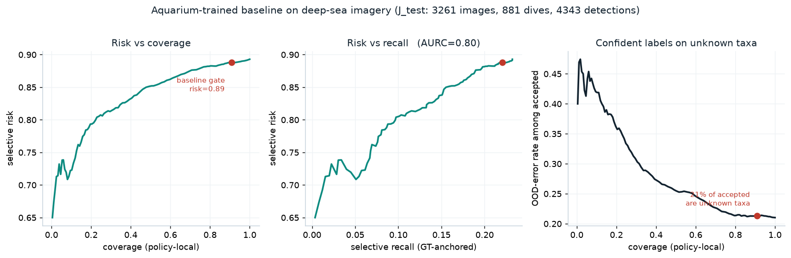

# Phase A results — frozen aquarium baseline on deep-sea imagery

Generated by `experiments/run_phase_a.py`; figure by `experiments/plot_phase_a.py`.
Numbers below are reproducible from the committed code, splits and
`IMAGE_V1_BASELINE` manifest. Cached predictions are gitignored (regenerable).

**What this measures.** `IMAGE_V1_BASELINE` — the 7-class aquarium-trained
pipeline — run unchanged on `J_test`: 3,261 deep-sea ROV frames, 881 dives,
where two-thirds of annotations are taxa outside its label space. No
retraining, no tuning. This is the motivating result for Part 1.

## Perception outcome (all emitted detections, any confidence)

4,343 detections over 3,261 images; 2,003 in-label-space GT objects.

| | images | share |
|---|---|---|
| produced ≥1 detection | 2,115 | 64.9% |
| produced none | 1,146 | 35.1% |

| outcome | count | share of detections |
|---|---|---|
| TP — matched, correct known class | 465 | 10.7% |
| CLS_ERR — matched, wrong known class | 263 | 6.1% |
| **OOD_ERR — matched a GT outside the label space** | **913** | **21.0%** |
| LOC_ERR — unmatched, IoU ∈ [0.10, 0.50) | 883 | 20.3% |
| BG_FP — unmatched, IoU < 0.10 | 1,819 | 41.9% |

Only about one detection in nine is correct. Two-fifths are background
false positives; a fifth land on organisms the model has no class for.

## Baseline operating point

Per-detection acceptance at τ = 0.40 on combined confidence (the primary
unit, PROTOCOL §1). This is a related but not identical policy to the
deployed image-level gate; the per-detection sweep is what the protocol
specifies and what the agent will be compared against.

| metric | value | 95% CI (dive bootstrap, 1000×) |
|---|---|---|
| accepted detections | 3,946 | — |
| **selective risk** | **0.888** | [0.876, 0.900] |
| selective recall (GT-anchored) | 0.221 | [0.206, 0.264] |
| coverage (policy-local) | 0.909 | — |
| **OOD-error rate among accepted** | **0.213** | [0.197, 0.232] |
| AURC vs recall | 0.803 | [0.770, 0.836] |
| AURC vs coverage | 0.834 | — |

## Reading

1. **Accepted detections are wrong ~89% of the time.** The system is not
   merely imperfect under domain shift; at its operating point it is wrong
   far more often than right.

2. **Confidence carries almost no signal about correctness.** Risk vs recall
   is nearly flat near 0.89 across the useful range, and even at the very
   lowest coverage the risk floor is ~0.65 — the most confident detections
   are still wrong two times in three. Coverage cannot be traded for
   reliability. This is the gap the agent must close.

3. **A fifth of accepted detections are confident labels on unknown taxa,
   and the fraction rises with confidence.** The OOD-error panel *increases*
   toward low coverage: the model's most confident deep-sea detections are
   among its most likely to be confident mis-identifications of organisms it
   was never trained on. A closed-set classifier with no abstention on
   novelty behaves exactly this way, and it is the failure a confident wrong
   species record represents in a real survey.

Together these define the Part 1 problem: reliability under domain shift
cannot come from the existing confidence score, and the system has no
mechanism to recognise the two-thirds of the scene that is out of
distribution.

## Test-set discipline

`J_test` has now been read **once**, to establish the frozen baseline's
reference numbers above (PROTOCOL §8). This is legitimate: the baseline is
frozen, so measuring it cannot tune it. The numbers here are the locked
baseline row of the final comparison.

**All Phase 1 design and exploration — calibration method choice,
uncertainty features, OOD scorer selection, abstention-aggregation
comparison, agent policy learning — must use `J_cal` / `J_policy`, never
`J_test`.** `J_test` is not to be read again until the final agent-vs-
baseline evaluation. Re-examining it during design would forfeit the
pre-registration in PROTOCOL §7.4.
